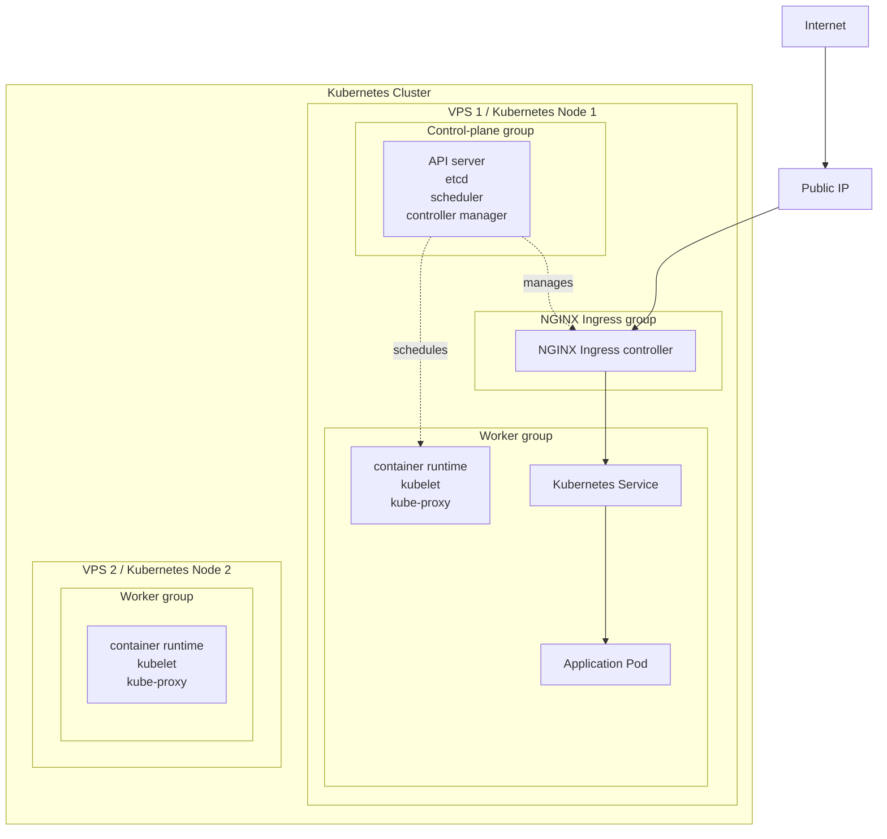

# Kubernetes flow

```mermaid
flowchart TB
    internet[Internet] --> publicIp[Public IP]

    subgraph cluster[Kubernetes Cluster]
        direction TB

        subgraph node1[VPS 1 / Kubernetes Node 1]
            direction TB

            subgraph ingressGroup[NGINX Ingress group]
                ingress[NGINX Ingress controller]
            end

            subgraph workerGroup[Worker group]
                worker[container runtime<br>kubelet<br>kube-proxy]
                service[Kubernetes Service]
                pod[Application Pod]
            end

            subgraph controlPlaneGroup[Control-plane group]
                controlPlane[API server<br>etcd<br>scheduler<br>controller manager]
            end
        end

        subgraph node2[VPS 2 / Kubernetes Node 2]
            subgraph workerGroup2[Worker group]
                worker2[container runtime<br>kubelet<br>kube-proxy]
            end
        end
    end

    publicIp --> ingress
    ingress --> service
    service --> pod
    controlPlane -. manages .-> ingress
    controlPlane -. schedules .-> worker
```
